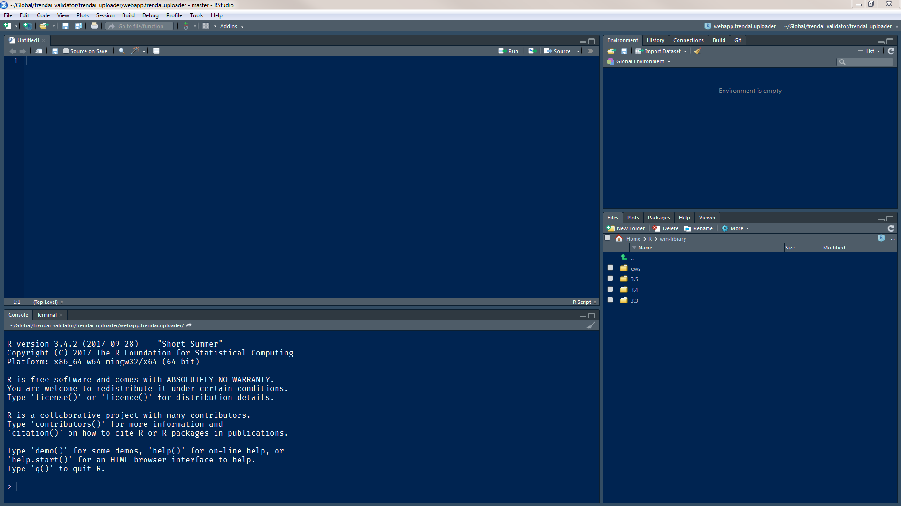
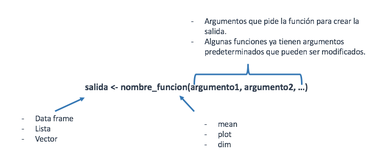

```{r setup, include=FALSE}
library(learnr)
knitr::opts_chunk$set(echo = FALSE)
```

##Introducción

###R y su historia

**R** es un lenguaje de programación estadístico el cuál facilita la manipulación, análisis y visualización de datos.
Creado en 1992 en Nueva Zelanda por Ross Ihaka y Robert Gentleman basado 
en el lenguaje S, con la intención de hacer un lenguaje didáctico para el curso 
de Introducción a la Estadística de la Universidad de Nueva Zelanda.

<center>{width=20%}</center>

###¿Por qué R?

- **R** es un software libre.
- Software multiplataforma el cuál funciona en Mac, Windows, y Linux.
- Es de código abierto, lo que permite su actualización constante.
- Remplaza la combinación de varios programas para el proceso de análisis de datos.
- Tiene una amplia documentación. 
- Funciona con cualquier tipo de archivo (txt,csv,JSON,sav,xlsx,etc...).
- Los gráficos disponibles son versátiles y de gran calidad.
- Se puede llegar a desarrollar proyectos tan elaboradas como: libros, aplicaciones web, 
  vinculación con otros lenguajes de programación, modelos estadísticos robustos, 
  simulaciones complejas, etc.
  
<p><center>{width=80%}</center><br>

<p><center>{width=80%}</center><br>

<p><center>{width=80%}</center><br>

###Diferencia entre R y RStudio

- En palabras simples **R** es el motor que ejecuta las operaciones que el usuario 
escribe teniendo una interfaz limitada para los usuarios.

- RStudio es un Ambiente de Desarrollo Integrado ya que expande la funcionalidad y flexibilidad 
de la interfaz de usuario para facilitar el trabajo en un mismo ambiente. 

 \fbox{RStudio es un Ambiente de Desarrollo Integrado ya que expande la funcionalidad y flexibilidad 
de la interfaz de usuario para facilitar el trabajo en un mismo ambiente.}

###Ventajas de RStudio

- Nos muestra objetos, historial, ayuda y paquetes instalados.
- Nos ayuda a un rápido manejo de scripts y códigos.
- Permite personalizar el ambiente de desarrollo.
- Nos permite el uso de proyectos.
- Tiene un visor de gráficos que unifica entornos.

<center>{width=15%}</center>

###¿Que es CRAN?

*CRAN* es una red de servidores alrededor del mundo que contiene las versiones y documentación actualizadas de **R**.
<center>{width=20%}</center>

###Instalación de R y RStudio

Para poder instalar dichos programas es necesario acceder a los siguientes links:

- R: https://cran.r-project.org/bin/windows/base/
- RStudio: https://www.rstudio.com/products/rstudio/download/

###Componentes de RStudio

RStudio esta compuesto por 12 paneles:

- Panel de código: nos permite escribir y organizar nuestro código para poder utilizarlo después.
- Panel de consola: en la cuál podremos interactuar con R al igual que con el panel de código.
- Panel de entorno: muestra los datos y variables que se están ocupando.
- Panel de historial: nos muestra el historial de comandos ejecutados.
- Panel de construcción: utilizado para la construcción y pruebas de un paquete.
- Panel de control de versiones: nos ayuda a interactuar con nuestro sistema de control de versiones.
- Panel de archivos: nos da la visualización de los archivos que tenemos en nuestros equipos.
- Panel de gráficos: mostrar las gráficas generadas.
- Panel de paquetes: permite conocer los paquetes que tenemos instalados y actualizarlos.
- Panel de ayuda: muestra la documentación de los paquetes y funciones.
- Panel de visualización: nos muestra la versión web de algún documento o visualización generada.
- Panel de terminal: nos ayuda a comunicarnos con nuestro sistema de control de versiones.

<center>{width=100%}</center>

##Funcionamiento básico

### Primera interacción con R

Una manera fácil de interactuar con R es mediante la consola ya que en ella podemos realizar ejecuciones sencillas como son las siguientes:
```{r operaciones,exercise =TRUE,}
# Suma
1+2
#Multiplicación
5*4
#División
7/8
```

### Asignación de variables

Muchas veces es necesario asignar un valor o conjuntos de valores a un objeto para poder utilizarlo sin necesidad de repetirlo constantemente. Esta asignación se hace mediante el operador `<-`.

<style>
div.blue { background-color:#e6f0ff; border-radius: 2px; padding: 10px;}
</style>
<div class = "blue">
**Nota:** Con el shortcut alt + - podemos generar `<-`.
</div>

* Asignación de un valor a una variable

```{r objetos,exercise =TRUE}
#Creamos un objeto
x <- 20
#Ocupamos el objeto
x/10
```
## Conceptos Generales

### Funciones en R

Una función es un grupo de instrucciones que parte de un "input" o datos de entrada para poder ejecutar una serie de códigos que al final nos regresará un resultado.

La estructura de una función es la siguiente:

<center>{width=90%}</center>

* Sumando dos números con la función `sum()`

```{r sum,exercise =TRUE}
sum(1,2)
```


###Ayuda en R

Para poder facilitarnos el programar, R nos proporciona documentación sobre sus paquetes y funciones. 

* Algunas funciones para encontrar ayuda son las siguientes

```{r help,echo=TRUE,eval=FALSE,warning=FALSE}
- help('sum')
- ?sum
- help.search('sum')
- #Directamente en el panel de ayuda
```

### Directorio de trabajo

**R** trabaja apuntando al directorio en nuestra computadora. Cuando estamos trabajando en **R** es importante saber en que directorio estamos trabajando para facilitar el movernos entre archivos.

* Saber en que directorio estamos

```{r dir,echo=TRUE,eval=TRUE}
getwd()
```

* Cambiar el directorio de trabajo

```{r dir1,echo=TRUE,eval=FALSE,warning=FALSE}
setwd("ruta_de_directorio")
```


### ¿Que es un script?

Un script es un archivo  con extensión .R que contiene las instrucciones (código) que necesitamos que se aplique
a ciertos elementos. Los scripts son utilizados cuando necesitamos guardar códigos que serán utilizados más tarde. 

Los scripts se pueden generar de dos maneras:

1. Presionando el icono de documento en la parte superior derecha.
2. Ctrl + Shift + N

Cuando se tiene código en un script y es necesario ejecutarlo para su evaluación se puede realizar de dos maneras:

1. Seleccionando la sección de código que se quiere ejecutar y presionando el botón de Run del panel de código.
2. Seleccionando el código y presionando Ctrl + Enter

### Comentarios

Es importante que dentro de los scripts se manejen lineas de comentario, esto con la finalidad de que en un futuro se tenga información de lo que representa cierto código, dichos comentarios se escriben poniendo el símbolo `#` antes del texto que contenga el comentario.

```{r com,exercise =TRUE}
5 + 8 #Código
#5 + 4 Comentario
```

### Paquetes en R

Los paquetes son un conjunto de funciones que nos ayudan a facilitar la programación en R. Cada que instalamos un paquete expandimos las funcionalidades que tiene de origen.

Para instalar un paquete se utiliza el siguiente código:

```{r ins1,echo=TRUE,eval=FALSE,warning=FALSE}
install.packages('data.table')
```

Una vez que instalamos un paquete es necesario cargarlo a nuestro environment para poder utilizarlo, esto lo hacemos de la siguiente manera:

```{r ins2,echo=TRUE,eval=FALSE,warning=FALSE}
library('data.table')
```

<style>
div.blue { background-color:#e6f0ff; border-radius: 2px; padding: 10px;}
</style>
<div class = "blue">
**Nota:** Es importante mencionar que solo es necesario instalar un paquete una vez pero que cada que se necesite utilizarlo es necesario cargarlo en nuestro environment.
</div>


###¿Que es un proyecto?

Es una carpeta que se reconoce como un espacio de trabajo de **R** el cuál nos ayuda a tener el ambiente necesario para realizar tareas de larga duración(paquete,aplicación,proyecto). 

Algunas de las ventajas de los proyectos es que nos ayudan a tener orden en los códigos, guardar historial del environment y permite recuperar las pestañas abiertas sin importar si la aplicación se cerró inesperadamente.

La manera de crear un proyecto es la siguiente:

1. Dar click a la pestaña superior izquierda que tiene la leyenda Project: (None).
2. Seleccionar nuevo proyecto
3. Seleccionar nuevo directorio
4. Seleccionar proyecto vacío
5. Completar los datos y presionar botón "Crear Proyecto".

### Guia de estilos 

Cuando trabajamos con **R** es importante mantener un estilo en tu código. Las siguientes recomendación están basadas en la guía de estilos de Hadley Wickham aunque tú puedes usar otra forma, solo procura ser consistente a lo largo de tu código. Recuerda que R es sensible a mayúsculas y minúsculas.

* Nombres de archivos: deben de tener un nombre descriptivo y no tener caracteres especiales.

```{r gi1,echo=TRUE,eval=FALSE}
# Bien
modelo-predictivo.R
lectura-datos.R

# Mal
código-añejo.r
versiondellunes.r
```

* Nombres de objetos: deben ser en minúsculas y utilizar `_` para separar palabras en el nombre.

```{r gi2,echo=TRUE,eval=FALSE}
# Bien
primer_cuartil
cuartil_1

# Mal
primer-cuartil
CuartilUno
C1
```

* Espacios: antes y después de todos los operadores fijos va un espacio (=, +, <-, etc)

```{r gi3,echo=TRUE,eval=FALSE}
# Bien
redondeo <- round((14.1562), digits = 2)

# Mal
redondeo<-round((14.1562),digits=2)
```

* Longitud de linea: trata de limitar tu código a una longitud de 80 caracteres por linea.

* Asignación: Es mejor usar solo `<-` para asignación en vez de `=` y usar el símbolo de igualdad solamente para argumentos dentro de funciones.

```{r gi4,echo=TRUE,eval=FALSE}
# Bien
x <- 23

# Mal
x = 23
```

* Comentarios: usa comentarios en tu código que expliquen el porque del código.

```{r gi5,echo=TRUE,eval=FALSE}
### Gráfica origen ########################################################
# Añadimos comentarios para ayudar al lector del código
```

**EJERCICIOS**

* **Crear un proyecto que se llame "introduccion_r"**
* **Verificar a que directorio esta apuntando**
* **Crear un script y nombrarlo**
* **Instalar y ejecutar el paquete `ggplot2`**
* **Crear una variable llamada numero_1 y asignarle un valor**
* **Crear una variable llamada numero_2 y asignarle un valor**
* **Sumar ambas variables**
* **Escribir comentarios en el script y correrlo.**


## Datos y objetos en R

### Datos más comunes 

- `numeric`: Son datos con números reales.
- `logical`: Son datos que sólo permite los valores lógicos de verdadero (T) o falso (F).
- `complex`: Son datos que pueden contener números complejos.
- `character`: Son cadenas de caracteres.
- `integer`: Son datos con número enteros.

* Declarando variables y comprobando que tipo de datos son

```{r tipo_datos,echo=TRUE,eval=TRUE}
w <- 1+2i
mode(w)
x <- 1 
mode(x)
y <- "Karen"
mode(y)
z <- TRUE
mode(z)
```

### Datos especiales

- `NA`: Valor faltante.
- `NULL`: Valor no definido.
- `Inf`: Resultado de dividir entre 0
- `NaN`: Resultado de una operación no definida (0/0).

###Tipos de Objetos en R

<p><center>{width=100%}</center><br>

  |   Objeto    | Definición                                                                                |
  |:-----------:|-------------------------------------------------------------------------------------------|
  | `Vectores`  | Secuencia de elementos/componentes del mismo tipo.                                        |
  | `Matrices`  | Estructura bidimensional de elementos de un mismo tipo                                    |
  |`Data Frames`| Estructura bidimensional de elementos de distintos tipos.                                 |
  |  `Listas`   | Estructura de datos de una dimensión que permite distintas clases de elementos en el 
                  objeto.                                                                                   |

**EJERCICIO:** Crea una variable que se llame mi_edad y asignarle el valor de tu edad. Después, imprimir el valor de la variable.

```{r ejer1, exercise=TRUE}

```

```{r ejer1-solution}
mi_edad <- 25
mi_edad
```


## Vectores
Secuencia de elementos/componentes del mismo tipo. 

#### Creando un vector

* Creando un vector con tres componentes de tipo carácter
```{r vecc, echo=TRUE,eval=TRUE}
x <- c("rosa","nardo","orquídea") # vector de flores asignado a x
x
```

* Creando un vector con una serie de números
```{r vecc1, echo=TRUE,eval=TRUE}
y <- 1:3 
y
```

* Creando un vector con una secuencia de 3 en 3
```{r vecc2, echo=TRUE,eval=TRUE}
v <- seq(1,10, by=3) 
v
```

* Creando un vector con dos vectores
```{r vecc3, exercise =TRUE}
w <- c(y,v) # vector creado por dos vectores
w
```

#### Acceder a un elemento del vector

* Crear un vector de 3 elementos y mostrar el elemento 3
```{r vec1, echo=TRUE,eval=TRUE}
x <- c("manzana","pera","platano")
x[3] 
```

* Mostrar todos menos el segundo elemento
```{r vec11, echo=TRUE,eval=TRUE}
x[-2] 
```

* Modificar el primer elemento
```{r vec12, echo=TRUE,eval=TRUE}
x[1] <- "mandarina" # Modificar un elemento
x
```

* Encontrar la posición de pera
```{r vec13, echo=TRUE,eval=TRUE}
which(x == "pera") 
```

* Encontrar la posición de todos los elementos menos pera
```{r vec14, echo=TRUE,eval=TRUE}
which(!x == "pera") 
```

#### Manejando vectores

* Ordenar los elementos de un vector (descendente)
```{r vec21, echo=TRUE,eval=TRUE}
y <- c("Karla","María","Aaron","Roberto","Aaron")
sort(y) 
```

* Ordenar los elementos de un vector (ascendente)
```{r vec22, echo=TRUE,eval=TRUE}
sort(y,decreasing = TRUE) 
```

* Mostrar los elementos únicos del vector
```{r vec23, echo=TRUE,eval=TRUE}
unique(y) 
```

* Saber la longitud del vector
```{r vec24, echo=TRUE,eval=TRUE}
length(y) # Saber la longitud del vector
```

* Nombrar elementos del vector
```{r vec25, echo=TRUE,eval=TRUE}
names(y) <- c("Prima","Hermana","Amigo","Tío","Amigo") 
```

#### Operaciones con vectores

* Sumar elementos del vector
```{r vec31, echo=TRUE,eval=TRUE}
x <- seq(5,100, by= 10)
y <- c(1,2)
sum(x) 
```

*Sumar dos vectores de diferente longitud
```{r vec32, echo=TRUE,eval=TRUE}
 x + y # suma de dos vectores de diferente longitud 
```

* Promedio de los elementos del 1 al 5
```{r vec33, echo=TRUE,eval=TRUE}
mean(x[1:5]) # promedio de los elementos del 1 al 5
```

* Máximo elemento del vector
```{r vec34, echo=TRUE,eval=TRUE}
max(x)
```

* Dos veces el cuadrado de x
```{r vec3, echo=TRUE,eval=TRUE}
w <- 2 * (x^2) 
```

* Resumen de datos del vector
```{r vec35, echo=TRUE,eval=TRUE}
summary(x) 
```

**EJERCICIOS**

* **Crear un vector con caracteres**
* **Crear dos vectores númericos de dos maneras diferentes **
* **Con los vectores anteriores crear un vector con un vector de caracteres y otro numerico**
* **Tratar de sumar un vector númerico y un vector de caracteres**

## Matrices

Estructura bidimensional de elementos de un mismo tipo.

#### Creando una matriz

* Elementos de una matriz

```{r matr, echo=TRUE,eval=FALSE}
matrix(data = NA, nrow = 1, ncol = 1, byrow = FALSE, dimnames = NULL)
```

| Argumentos | Significado del argumento                                   |
|:----------:|-------------------------------------------------------------|
|   `data`   | Datos a ingresar en la matriz.                              |
|   `nrow`   | Número de filas requeridas.                                 |
|   `ncol`   | Número de columnas requeridas.                              |
|   `byrow`  | Si es falso la matriz se llena por columna, de otra manera                   
               se llenará primero por filas.                               |
| `dimnames` | Utilizado para darles nombres a las filas y a las columnas,                  
               respectivamente.                                            |
  
* Creando una matriz de 1 con 4 columnas y renglones con nombres

```{r matr1, echo=T}
m <- matrix(1,nrow = 4,ncol = 4,dimnames = list(c("Elm1","Elm2","Elm3","Elm4"),c("Var1","Var2","Var3","Var4")))
m
```

* Creando una matriz con  un vector

```{r matr2, echo=T}
flores <- c("Margaritas", 100, "Orquídea", 400, "Rosas", 200)
m <- matrix(flores, ncol = 2, byrow = T,dimnames = list(c("Flor 1","Flor 2","Flor 3"),c("Flor","Precio")))
m
```

* Crear una matriz con tres vectores 

```{r matr3, echo=T}
Productos <- c("Galletas", "Leche", "Tortillas","Pan","Huevo")
Precio <- c(15, 20, 14,8,25)
Tiendas <- c("Autoservicio","Mayoreo","Mayoreo","Mayoreo","Autoservicio")
m_productos <- matrix(c(Tiendas,Productos,Precio), ncol = 3)
m_productos
```

#### Acceder a elementos de la matriz

* Acceder al renglón 2 de la matriz
```{r matr4, echo=TRUE,eval=TRUE}
m_productos[2,]  
```

* Acceder a la columna 3 de la matriz
```{r matr5, echo=TRUE,eval=TRUE}
m_productos[,3]  
```

* Cambiar el valor del renglón 1 y columna 2 por 5
```{r matr6, echo=TRUE,eval=TRUE}
m_productos[1,2] <- 5  
```

#### Manejando matrices

* Mostrar los primeros elementos de la matriz
```{r matr7, echo=TRUE,eval=TRUE}
head(m_productos)  
```

* Mostrar los últimos elementos de la matriz
```{r matr8, echo=TRUE,eval=TRUE}
tail(m_productos)  
```

<style>
div.blue { background-color:#e6f0ff; border-radius: 2px; padding: 10px;}
</style>
<div class = "blue">
**Nota:** Las funciones mostradas para manejo de vectores también aplican para los elementos de renglones y columnas de la matrices(sum,mean,unique,etc)
</div>

#### Operaciones con matrices 

 Las operacionescon matrices mediante operadores aritméticos se realizan componente a componente como es el caso de los vectores.
 
* Suma de matrices 
```{r matr9, echo=TRUE,eval=TRUE}
m1 <- matrix(c(1:4),nrow =2) 
m2 <- matrix(c(8:5),nrow =2) 
m1+m2

```

* Resta de matrices 
```{r matr10, echo=TRUE,eval=TRUE}
m2-m1
```

* Producto Matricial
```{r matr101, echo=TRUE,eval=TRUE}
m1 %*% m2
```

* Matriz transpuesta
```{r matr11, echo=TRUE,eval=TRUE}
t(m1)
```

* Diagonal principal de una matriz
```{r matr12, echo=TRUE,eval=TRUE}
diag(m1)
```

* Determinante de una matriz
```{r matr13, echo=TRUE,eval=TRUE}
det(m1)
```

* Inversa de una matriz
```{r matr14, echo=TRUE,eval=TRUE}
solve(m1)
```

* Resolviendo sistemas de ecuaciones
Si tenemos el siguiente sistema de ecuaciones:
 + 5x+3y=2
 + 2x+y=3

```{r matr16, echo=TRUE,eval=TRUE}
datos <- matrix(c(5,3,2,1),ncol = 2,byrow = TRUE)
resultado <- c(2,3)
solve(datos,resultado)
```

**EJERCICIOS**

* **Crear 1 matriz de 4x4 y una de 6x4 y hacer su producto matricial**
* **Asignar nombres a las columnas y las filas  de una matriz creada  **
* **Cambiar el valor de la posición [6,2] de la matriz 2**
* **Resolver el sistema de ecuaciones siguiente:**
    **2x+y-3z=7**
    **5x-4y+z=-19**
    **x-y-4z=4**

## Data Frames

Estructura bidimensional de elementos de distintos tipos con la misma longitud.

#### Creando un data frame

* Crear un data frame a partir de vectores

```{r df1, echo=TRUE,eval=FALSE}
df <- data.frame(
    columna1 = 1:8,
    columna2 = c(TRUE,FALSE,TRUE,TRUE,TRUE,FALSE,TRUE,TRUE),
    columna3 = LETTERS[1:8],
    z = runif(8,min = 2,max = 5)
)
```

* Crear un data frame a partir de una matriz y cambiar nombres de columnas

```{r df2, echo=TRUE,eval=TRUE}
df <- as.data.frame(m_productos)
names(df) <- c("Tipo","Producto","Precio")
df
```

En **R** existen varios data frame precargados con los que podemos empezar a explorar este tipo de objetos sin tener que importarlos o crearlos. Como ejemplo utilizaremos el data frame de movies del paquete  `ggplot2movies`.

Para utilizarlo es necesario instalarlo y cargarlo a nuestro environment.

```{r df3, echo=TRUE,eval=FALSE,warning=FALSE}
install.packages("ggplot2movies")
```

```{r df31, echo=TRUE,eval=TRUE,warning=FALSE}
library(ggplot2movies)
```

### Explorando un data frame

Para conocer cuantas filas y columnas tiene un data frame podemos verlo directamente en el panel de entorno o ocupando la siguiente función:

```{r df41, echo=TRUE,eval=TRUE}
dim(movies)  
```

* Mostrar las primeras 6 observaciones de la base.

```{r df4, echo=TRUE,eval=TRUE}
head(movies)  
```

* Mostrar las últimas 6 observaciones de la base.

```{r df5, echo=TRUE,eval=TRUE}
tail(movies)  
```

* Mostrar el data frame completo en el panel de código

```{r df6, echo=TRUE,eval=FALSE}
View(movies)  
```

* Mostrar resumen estadístico del data frame

```{r df7, echo=TRUE,eval=TRUE}
summary(movies)  
```

* Mostrar la estructura de un objeto 

```{r df8, echo=TRUE,eval=TRUE}
str(movies)  
```

### Manejando Data frames

Al igual que en el caso de vectores, con los data frame usamos [ ] para tener acceso a sus elementos. En este caso tenemos que indicar tanto las filas como las columnas.

<center>`dataframe[filas, columnas]`</center>

* Elegir una fila

```{r df9, echo=TRUE,eval=TRUE}
movies[15,] 
```

* Elegir una columna

```{r df10, echo=TRUE,eval=TRUE}
head(movies[,3] )
```

* Elegir una fila y una columna

```{r df11, echo=TRUE,eval=TRUE}
movies[12, c(1,2,6)]
```

* Elegir filas y columnas especificas

```{r df12, echo=TRUE,eval=TRUE}
movies[1:50, c(1,2,6)]
```

Otra manera de extraer una columna es escribiendo el nombre del data frame, agregar el signo `$` seguido del nombre de las columnas.

```{r df13, echo=TRUE,eval=TRUE}
head(movies$title)
```

Esto nos permite trabajar las columnas como vectores

```{r df14, echo=TRUE,eval=TRUE}
mean(movies$rating)
```

* Extraer un subconjunto del data frame 

```{r df15, echo=TRUE,eval=TRUE}
drama <- subset(movies, Drama == 1) # primer argumento nombre del data frame el segundo la condición a cumplir
head(drama)
```

### Transformando data frames 

Cuando necesitamos agregar columnas a un data frame tenemos varias formas de hacerlo:

* Creando columnas con la función `within()`

```{r df16, echo=TRUE,eval=TRUE}
m <- within(movies, {     # Podemos agregar varias columas
    horas = length/60
    rating_centrado = rating - mean(rating)
    rating_est = rating_centrado/sd(rating)  # Podemos usar una columna que ya creamos

})

head(m)
```

* Agregar columnas con el signo `$` y con el comando de asignación `<-`

```{r df17, echo=TRUE,eval=TRUE}
movies$length_horas <- movies$length/60
head(movies)
```

+ Crear una columna utilizando dos columnas del data frame

```{r df18, echo=TRUE,eval=TRUE}
movies$r1_r2 <- movies$r1+movies$r2
head(movies)
```

+ Crear una columna aplicando una condición sobre otra columna

```{r df181, echo=TRUE,eval=TRUE}
movies$r1_mayor <- ifelse(movies$r1>=5,1,0)
head(movies)
```

+ Creando un vector sumando dos columnas del data frame

```{r df19, echo=TRUE,eval=TRUE}
m <- with(movies, {
  suma = r1 + r2
})

head(m)
head(movies)
```

* Uniendo dos data frames con las mismas columnas 

```{r df20, echo=TRUE,eval=TRUE}
drama <- subset(movies, Drama == 1)
action <- subset(movies, Action == 1)
dra_act <- rbind(drama,action)
dra_act
```

Para fusionar dos data frames se utiliza la función `merge()` la cual tiene los siguientes argumentos:

```{r df22, echo=TRUE,eval=FALSE}
merge(x = df1,y = df2 ,by.x = "id_var1",by.y = "id_var2")
```

| Argumentos | Significado del argumento                                   |
|:----------:|-------------------------------------------------------------|
|   `x`      | Nombre del primer data frame.                               |
|   `y`      | Nombre del segundo data frame.                              |
|   `by`     | Si tienen el mismo nombre las columnas de id  para los dos data frames se coloca el nombre de la                     columna.                                                    |
|  `by.x`    | Nombre de la columna que sera el id del primer data frame.  |
|  `by.y`    | Nombre de la columna que sera el id del segundo data frame. |
 

* Fusionar dos data frames por una columna id 

```{r df21, echo=TRUE,eval=TRUE}
movies$id <- 1:nrow(movies) 
df_1 <- movies[,c("id","year")]
df_2 <- movies[,c("id","length")]
df_union <- merge(df_1,df_2,by="id")
head(df_union)
```

**EJERCICIOS**

* **Crear un data frame de movies que tenga solo las peliculas del año 2000 en adelante**
* **Crear una nueva variable que llame aplica la cuál tenga el valor de 1 si el rating es mayor a 8 y 0 en otro    caso**
* **Filtrar solo las variables en las que aplica tenga valores de uno**
* **Sacar el promedio del rating de la base filtrada **
* **Sacar el promedio del rating de la base filtrada **
* **Encontrar cuál es la pelicula que tiene más votaciones en el año 2005 **

## Listas

Colección de objetos  que nos permite agrupar elementos de distintos tipos y tamaños ya sean vectores, data frames o matrices.

#### Creando listas 

Para crear una lista utilizamos la función `list()` donde cada parámetro ingresado será elemento de la lista.

* Creando una lista con dos vectores 

```{r l1, echo=TRUE,eval=TRUE}
lista <- list(1:30, c("A", "B", "C"))
lista
```

* Creando una lista con un data frame y un vector

```{r l2, echo=TRUE,eval=TRUE}
lista_df <- list(df1 = movies[1:5,1:10] , letras = LETTERS[1:25])
lista_df
```

#### Explorando listas

* Saber cuantos elementos tiene una lista

```{r l31, echo=TRUE,eval=TRUE}
length(lista_df)
```

* Acceder al primer elemento de la lista

```{r l41, echo=TRUE,eval=TRUE}
lista_df[[1]]
```

* Acceder al elemento 2 de la lista y a la variable 1 
```{r l51, echo=TRUE,eval=TRUE}
lista_df[[2]][1]
```

#### Transformando listas

* Añadir un elemento a la lista

```{r l61, echo=TRUE,eval=TRUE}
lista_df[[3]] <- 1:15
lista_df
```

* Agregar un nombre a un elemento de la lista

```{r l71, echo=TRUE,eval=TRUE}
names(lista_df) [3] <- "numeros"
lista_df
```

* Eliminar un elemento de la lista

```{r l81, echo=TRUE,eval=TRUE}
lista_df[-3] 
```

**EJERCICIOS**

* **Crear una lista que tenga un vector, una matriz y un data frame**
* **Nombrar cada objeto del vector**
* **Sumar los elementos del vector de la lista**
* **Eliminar un objeto de la lista y agregar un vector de 100 componenete NA**

### Leer datos externos 

En la mayoría de las ocasiones, tenemos que hacer uso de datos de fuentes externas. La función `read.table()` nos ayuda a leer archivos de texto con distintas delimitaciones ( “;”, “,”, “|”).

```{r re11, echo=TRUE,eval=TRUE}
tabla <- read.table(file = "http://allman.rhon.itam.mx/~ebarrios/EstadisticaDescriptiva/cableTV.dat", 
                    header = TRUE)
head(tabla)
```

Para leer archivo con extensión .csv podemos ocupar la función `read.csv`

```{r re21, echo=TRUE,eval=TRUE}
direccion <- read.csv(file = "https://people.sc.fsu.edu/~jburkardt/data/csv/trees.csv")
head(tabla)
```

Para leer archivos con extensión .xls o .xlsx, existen algunos paquetes como `readxl` y `openxlsx`. Para archivos de SPSS, SAS, Stata y Minitab existe el paquete `haven` y `foreign`.

**EJERCICIOS**

* **Leer un archivo de excel que tengas en tu computadora utilizando readxl y la función read_excel**

### Gráficas en R
En R existen paquetes que nos ayudan a generar gráficas sofisticadas, como son `ggplot2` y `Plotly`. Sin embargo, R base cuenta con funciones para crear gráficas de manera sencilla, como es el caso de plot().

La función `plot()` tiene como argumentos básicos el eje `x` y `y`

* Graficando ratings vs votos
```{r gr, echo=TRUE,eval=TRUE}
plot(x = movies$rating, y = movies$votes)
```

* Histograma de rating
```{r gr2, echo=TRUE,eval=TRUE}
hist(x = movies$rating)
```

* Boxplot de rating
```{r gr3, echo=TRUE,eval=TRUE}
boxplot(x = movies$rating)
```

<style>
div.blue { background-color:#e6f0ff; border-radius: 2px; padding: 10px;}
</style>
<div class = "blue">
**Nota:** Se profundizara en visualizaciones en el taller de ggplot2.
</div>

### Ciclos en R

Cuando es necesario programar rutinas requerimos usar las estructuras condicionales y los ciclos (loops). 

Estructura condicional `if`

```{r ci, echo=TRUE,eval=FALSE}
if (test_expression) {
statement
}
```

* Ocupando un `if`

```{r ci1, echo=TRUE,eval=FALSE}
x <- 5

if(x > 0){
print("Positivo")
}
```

Estructura condicional `if...else`

```{r ci2, echo=TRUE,eval=FALSE}
if (test_expression) {
statement1
} else {
statement2
}
```

* Ocupando un `if...else`

```{r ci3, echo=TRUE,eval=TRUE}
x <- -5

if(x > 0){
  
print("No negativo")
  
} else {
  
print("Negativo")
  
}
```

Ciclo `for`

```{r ci4, echo=TRUE,eval=FALSE}
for(i in 1:n) {
  expression
}
```

* Ocupando un `for`

```{r ci5, echo=TRUE,eval=TRUE}
nombres <- c("Teresa", "Mariana", "Juan", "Mario", "Luis")

for(i in 1:length(nombres)) {

  print(nombres[i])
  
}
```

Ciclo `while`

```{r ci6, echo=TRUE,eval=FALSE}
while(test_expression) {
  expression
}
```

* Ocupando un `while`

```{r ci7, echo=TRUE,eval=TRUE}
x <- 1
while(x < 5) {
  x <- x + 1
  print(x)
}
```

**EJERCICIOS**

* **Hacer un vector que contenga los números del 1 al 28**
* **Hacer un ciclo que imprima en pantalla "Curso de R" si el número es 26 en otro caso que imprima "No hay curso"**

## Familia Apply

La familia de funciones apply es usada para aplicar una función a cada elemento de una estructura de datos. En particular, es usada para aplicar funciones en matrices, data frames y listas.Con esta familia de funciones podemos automatizar tareas complejas usando poca líneas de código.


 * Apply
 
Aplica una función a todos los elementos de una matriz o data frame.

```{r apl, echo=TRUE,eval=FALSE}
apply(X, MARGIN, FUN)
```

| Argumentos | Significado del argumento                                   |
|:----------:|-------------------------------------------------------------|
|   `x`      | Una matriz o un objeto que pueda transformar a una matriz, 
                generalmente, un data frame.                               |
| `MARGIN`   | 1 si ocuparemos la funcion en renglones, 2 si es en columnas|
|   `FUN`    | La función que aplicaremos a la matriz.      

* Sumando valores de las columnas
```{r ap1, echo=TRUE,eval=TRUE}
mi_df <- data.frame(v1 = 1:3, v2 = 4:6)
 apply(X = mi_df, MARGIN = 2, FUN = sum)
```

* Sacando la media de los valores de las filas
```{r ap2, echo=TRUE,eval=TRUE}
apply(X = mi_df, MARGIN = 1, FUN = mean)
```

* Lapply

Es un caso especial de `apply`, diseñado para aplicar funciones a todos los elementos de una lista, `lapply` intentará cambiar a una lista el objeto que demos como argumento y después aplicará una función a todos sus elementos regresandonos los resultados en una lista.

Dado que en R todas las estructuras de datos pueden modificarse a una lista, `lapply` puede usarse en un número más amplio de casos que `apply`.

```{r la1, echo=TRUE,eval=FALSE}
lapply(X,FUN)
```

| Argumentos | Significado del argumento                                   |
|:----------:|-------------------------------------------------------------|
|   `x`      | Una lista o un objeto modificable a una lista.              |
|   `FUN`    | La función que aplicaremos a la lista.                      |

* Sacando la media de cada columna del data frame

```{r la2, echo=TRUE,eval=TRUE}
lapply(X = mi_df,FUN = mean)
```

* Sacando la raíz de cada elemento de una matriz

```{r l3, echo=TRUE,eval=TRUE}
lapply(X = as.matrix(mi_df),FUN = sqrt)
```

* Sacando la raíz de un vector

```{r l4, echo=TRUE,eval=TRUE}
lapply(X = as.vector(mi_df[,1]),FUN = sqrt)
```

### Usando lapply() en lugar de un ciclo for

En muchos casos es posible reemplazar un bucle `for` por un `lapply` ya que `lapply` esta haciendo lo mismo que un `for`, está iterando una operación en todos los elementos de una estructura de datos.

* Aplicando una función a todas las columnas de un data frame con `for`

```{r l5, echo=TRUE,eval=TRUE}
movies_max <- NULL
i <- 1
movies_rating <- movies[,5:6]
columnas <- ncol(movies_rating)
for(i in 1:columnas) {
  movies_max[i] <- max(movies_rating[, i])
  i <- i +1
}

movies_max
```

* Aplicando una función a todas las columnas de un data frame con `lapply`

```{r l6, echo=TRUE,eval=TRUE}
as.numeric(lapply(movies_rating,max))
```

Nota: Ocupamos la función as.numeric() para hacer cambio a tipo numérico.

* Sapply

Es una versión simplificada de lapply. Es decir, sapply aplica la función lapply y simplifica la salida.

```{r l7, echo=TRUE,eval=TRUE}
sapply(movies_rating,max)
```

**EJERCICIOS**

* **Sacar el promedio de budget del data frame de movies utilizando apply**
* **Sacar el promedio de budget del data frame de movies utilizando lapply**
* **Sacar el promedio de budget del data frame de movies utilizando for**
* **Sacar el promedio de budget del data frame de movies utilizando sapply**


## Funciones para cadenas de caracteres

Cuando trabajamos con cadenas de caracteres es muy importante poder concatenar varios elementos, `paste()`  convierte sus argumentos en caracteres y los concatena tomando en cuenta un separador entre elementos.

* Concatenando elementos 

```{r ca, echo=TRUE,eval=TRUE}
paste("hola", "vales", 1000, sep = "-")
```

* Concatenando vectores
```{r ca1, echo=TRUE,eval=TRUE}
paste(1:5, letters[1:5], sep = "")
```

Cuando necesitamos encontrar un patrón dentro de una cadena de caracteres utilizamos `grep()`, el cuál nos regresa las posiciones en el vector que cumplen las condiciones del patrón.

* Posiciones del vector que tienen el patrón que buscamos

```{r ca2, echo=TRUE,eval=TRUE}
patron <- grep(pattern = "Star Wars", movies$title)
```

* Elementos del vector que contienen el patrón buscado.

```{r ca3, echo=TRUE,eval=TRUE}
movies$title[patron]
```

* Saber cuantos elementos del vector tienen el patrón que buscamos
```{r ca4, echo=TRUE,eval=TRUE}
table(grepl(pattern = "Star Wars", movies$title))
```

Cuando necesitamos extraer algunos elementos  de una cadena podemos utilizar la función `substr`

```{r ca5, echo=TRUE,eval=TRUE}
cadena <- paste("hola", "vales", 1000, sep = "-")
substr(cadena,1,4)
```

**EJERCICIOS**

* **Con el data fram de movies crear un nuevo data frame que contenga las peliculas que en su titulo lleven la palabra Love**

## Creando mi propia función

Como vimos arriba las funciones son parte fundamental de **R** por este motivo es importante saber hacer una función. La estructura para crear una fusión es la siguiente:

```{r funct, echo=FALSE,eval=FALSE,warning=FALSE}
ejemplo_funcion <- function(argumento_1,argumento_2){

  return()
}
```

* Creando una función que reciba dos caracteres y los concatene separandolos con "-"
```{r funct1, echo=TRUE,eval=TRUE}
mi_funcion <- function(x,y){
  resultado <- paste(x,y,sep = "-")
  return(resultado)
}
mi_funcion("Karen","Estefania")
```

* Creando una función que reciba un data frame y lo seleccione las columnas mencionadas
```{r funct22, echo=TRUE,eval=TRUE}
mi_funcion <- function(df,y){
  resultado <- df[,y]
  return(resultado)
}
mi_funcion(movies,c("Drama","Action"))
```

**EJERCICIOS**

* **Crear una función que pueda sumar  y restar  solo con modificar un argumento**
* **Hacer una función que me diga si el numero ingresado es par **


### Regresiones en R
    
Para poder realizar regresiones lineales en *R* podemos ocupar la función `lm()`. 
  
<center>`lm(formula,data)`</center>

* Haciendo una regresión lineal
  
```{r re100, echo=TRUE,eval=TRUE}
lmovies <- lm(formula = rating~ r1,data = movies)
```
  
* Resumen de la regresión
  
```{r re2, echo=TRUE,eval=TRUE}
summary(lmovies) 
```
  
### Análisis de varianza ANOVA
  
Para poder hacer una prueba ANOVA ocupamos la función `aov`
  
<center>`aov(formula,data)`</center>
  
* Ejemplo de ANOVA
  
```{r an2, echo=TRUE,eval=TRUE}
amovies <- aov(formula = rating~ votes,data = movies)
```
  
* Resumen de ANOVA

```{r an3, echo=TRUE,eval=TRUE}
summary(amovies) 
```

## Páginas de interés

* [Cheatsheets](https://www.rstudio.com/resources/cheatsheets/) 
* [Stackoverflow](https://stackoverflow.com/) 
* [Rviews](https://rviews.rstudio.com/) 
* [DataCamp](https://www.datacamp.com/community/tutorials)

<center>{width=20%}</center>

